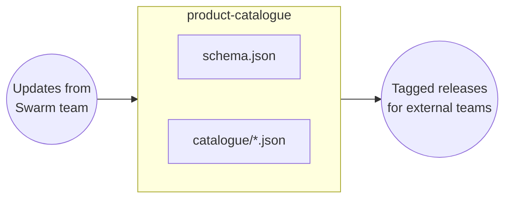
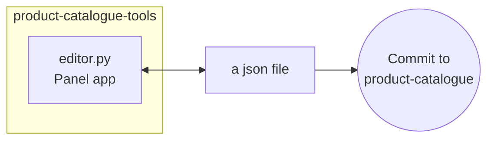

# product-catalogue-tools

## Overview

This repository contains tools for editing and displaying the contents of the linked `product-catalogue` repository. That repository holds json files (one for each data product) containing the product metadata. The schema is defined using [JSON Schema](https://json-schema.org/overview/what-is-jsonschema).



This repository contains `editor.py` that serves a [Panel application](https://panel.holoviz.org/) that can be used to edit the json records individually. The tool allows creation of new records and editing of existing records, to generate a new json file which must then be then manually committed to the `product-catalogue` repository.



## Development setup

```
git clone --recurse-submodules git@github.com:Swarm-DISC/product-catalogue-tools.git
```

Create a virtual environment with Python 3.12 (example shows [uv](https://docs.astral.sh/uv/), but other tools can be used)
```
uv venv --python 3.12
source .venv/bin/activate
uv pip install -r requirements.dev.txt
```

Develop using any editor and test the dashboard in the browser:
```
panel serve editor.py --autoreload
```

Or use JupyterLab:
```
jupyterlab
```
Right click on `editor.py` and select `Open With / Notebook` (the notebook is stored as `.py` file using jupytext). See the [Panel documentation](https://panel.holoviz.org/tutorials/basic/develop_notebook.html) for more info.

## Deployment of the editor

### Docker

See `Dockerfile`.

The old deployment (from [swarm-handbook-experiment](https://github.com/smithara/swarm-handbook-experiment)) is still accessible at <http://140.238.64.100/json_creator> but will be replaced once this project is ready.

### WASM and Pyodide?

See <https://panel.holoviz.org/how_to/wasm/standalone.html>
```
panel convert editor.py --to pyodide-worker --out pyodide --requirements requirements.editor.txt
python -m http.server
```
This seems to require `editor.py` to be self contained, without local imports. And the catalogue loading needs to be changed to make http requests?

## TODO

- Refactor code to rely directly on `schema.json`
- Add fields like version information, in support of the DOI task
- Use dependabot to auto-update the product-catalogue submodule
- Deploy html previews to github pages
- Deploy panel application
- Investigate mapping to SPASE
